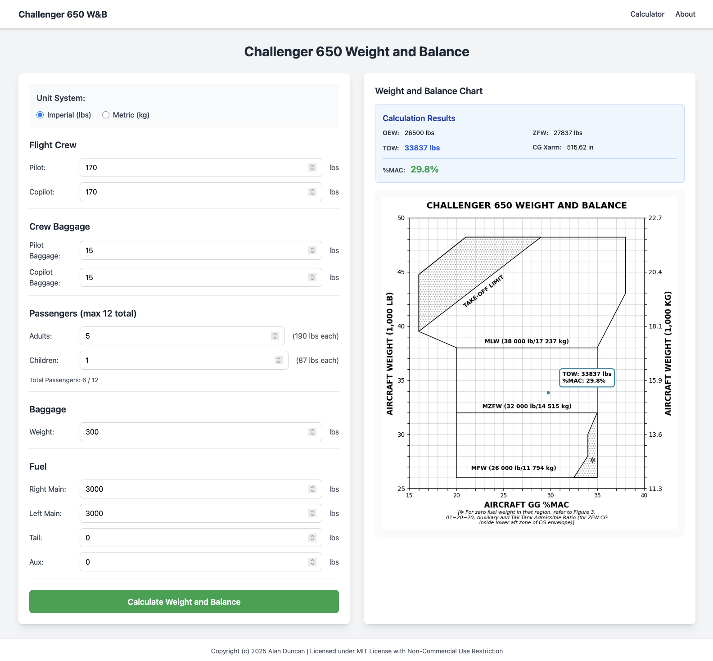

# Challenger 650 Weight and Balance Application

A Flask web application for calculating and visualizing weight and balance for the Challenger 650 aircraft.



## Features

- Collect weight and balance data:
  - Flight crew weights (up to 3, default 170 lbs each)
  - Passengers: adults (190 lbs each) and children (87 lbs each), max 12 total
  - Baggage weight
  - Fuel weights: right main, left main, tail, and aux tanks
- Support for both metric and imperial units with user preference toggle
- Server-generated weight and balance chart display
- Responsive UI using Tailwind CSS

## Installation

1. Install dependencies:
```bash
pip install -r requirements.txt
```

2. Run the application:
```bash
python app.py
```

3. Run the application:
```bash
python app.py
```

   Or specify a custom port:
```bash
PORT=8080 python app.py
```

4. Open your browser and navigate to:
```
http://localhost:6969
```
   (or the port you specified via PORT environment variable)

## Project Structure

```
cl650_wb/
├── app.py                  # Flask application
├── challenger650_wb.py     # Chart generation functions
├── utils.py                # Unit conversion utilities
├── templates/
│   └── index.html          # Main HTML template
├── static/
│   └── charts/            # Generated chart images
└── requirements.txt        # Python dependencies
```

## Usage

1. Select your preferred unit system (Imperial or Metric) using the toggle button
2. Enter flight crew weights (up to 3 crew members)
3. Enter number of adult and child passengers (max 12 total)
4. Enter baggage weight
5. Enter fuel weights for each tank
6. Click "Calculate Weight and Balance" to generate the chart

The chart will display with a test point. Actual weight and balance calculations will be implemented in a future update.

## Development

The application uses:
- Flask for the web framework
- Matplotlib for chart generation
- Tailwind CSS (via CDN) for styling

## Notes

- Chart images are saved to `static/charts/` directory
- Session-based unit preference storage
- All internal calculations will use pounds (lbs) for weights and gallons (gal) for fuel volumes

## License

This project is licensed under a custom MIT-style license with non-commercial use restriction. See [LICENSE](LICENSE) for details.

**Summary:**
- ✅ Attribution required
- ✅ Non-commercial use only
- ✅ Free to use, modify, and share for non-commercial purposes
- ❌ Commercial use is prohibited

